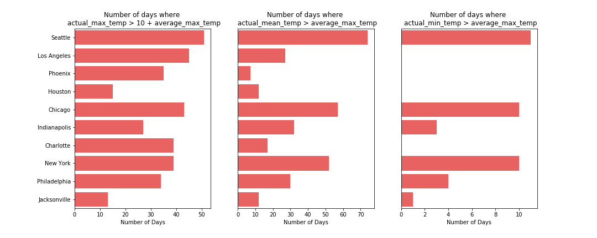
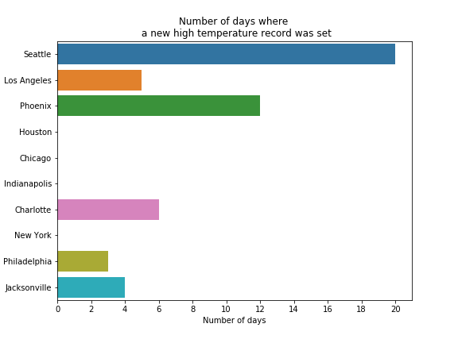
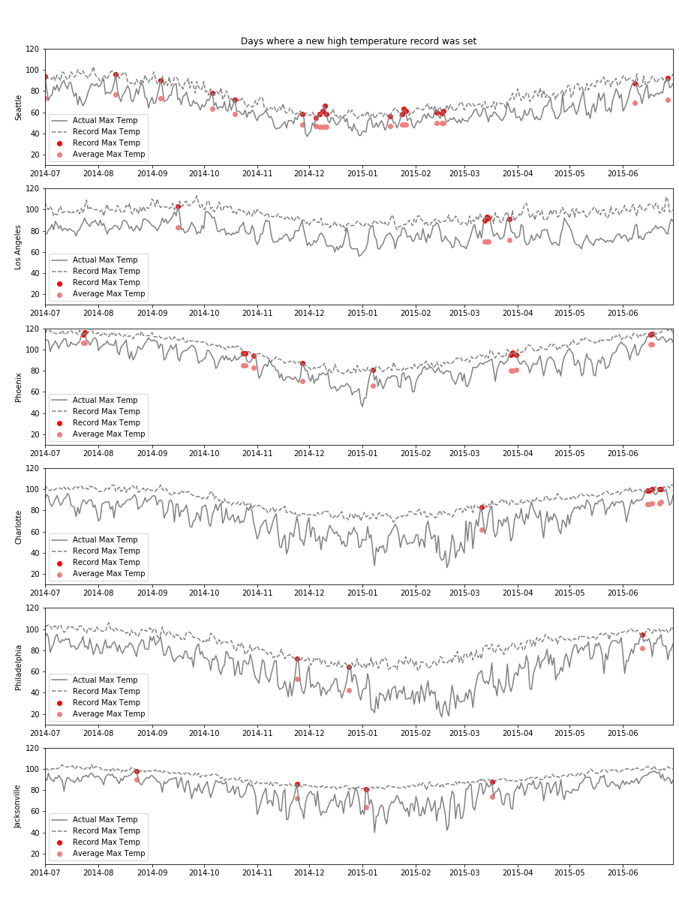
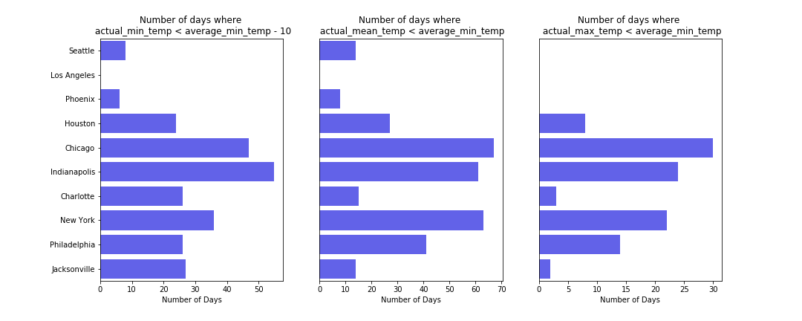
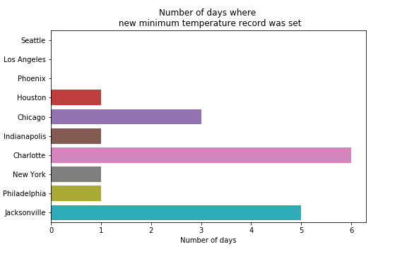
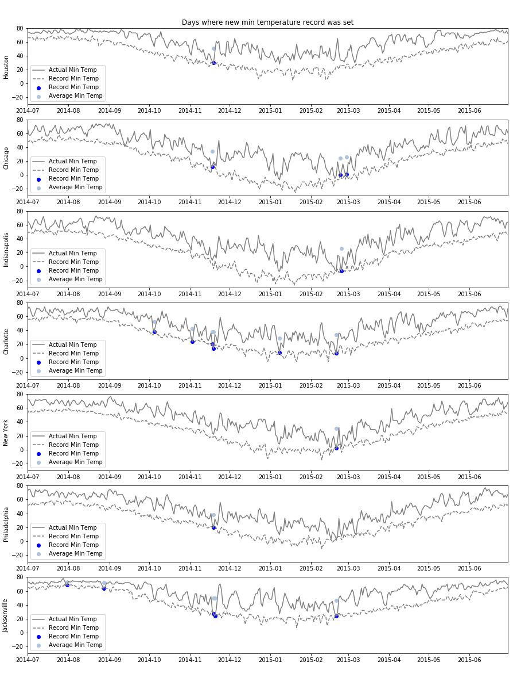
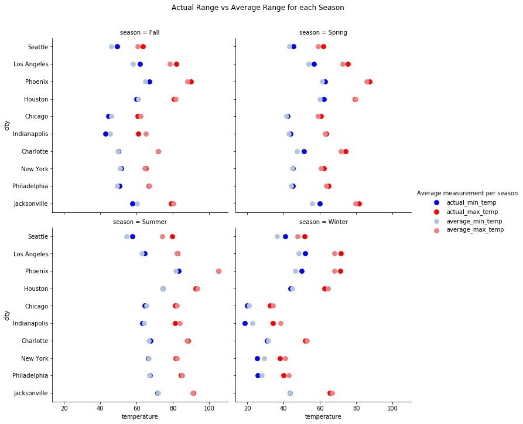
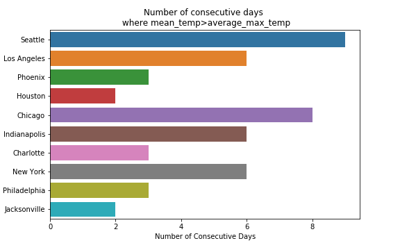
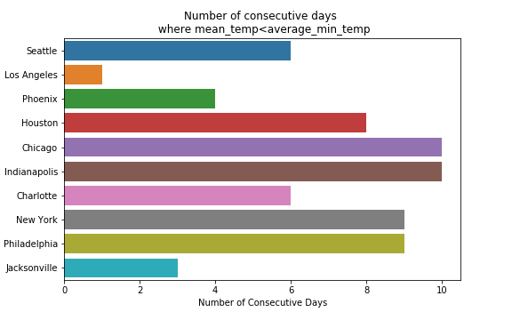

# Overview

In this report, I explain the steps I followed to explore, visualize and analyze some aspect of the weather history data available [here](https://github.com/fivethirtyeight/data/tree/master/us-weather-history).

**Brief Explanation of the Datasets**

The datasets consist of daily weather measures recorded from July 1, 2014 to June 30, 2015 for 10 US cities. These cities are: Seattle, Los Angeles, Phoenix, Houston, Chicago, Indianapolis, Charlotte, New York, Philadelphia, and Jacksonville. The daily weather measures consist of the following:
- the date of the weather record
- the average temperature for that day
- the maximum temperature for that day
- the minimum temperature for that day
- the average maximum temperature on that day since 1880
- the average minimum temperature on that day since 1880
- the lowest ever temperature on that day since 1880
- the highest ever temperature on that day since 1880
- the year that the lowest ever temperature occurred
- the year that the highest ever temperature occurred
- the measured amount of rain or snow for that day
- the average amount of rain or snow for that day since 1880
- the highest amount of rain or snow for that day since 1880

**Focus of the Analysis**

In this report, I focus on exploring for each city, the extreme weather factors that occurred, in terms of maximum temperature and minimum temperature, from July 2014 to June 2015. In particular, I address the following questions:
- How do extreme weather features change from one city to another? Are they uniform across the cities? Or does each city experience some unique conditions?
- Were there any days of that year where new records of high or low temperatures were set? If so, in which months of the year?
- How does the actual range of temperatures differ from the normal (or expected) range of temperatures across the seasons of the year for each city?
- What was the longest period of consecutive warm days (or cold days) for each city?

Note that by extreme factor, I mean the value of a maximum or minimum temperature that occurred in a given day and that falls outside the range of expected or normal values for that day.

**Outline of the Report**

This document is organized as follows: 
1. loading and checking the consistency of the data;
2. exploring the occurrence of unusual warm or hot days for each city;
3. exploring the occurrence of unusual cold days for each city;
4. comparing between the actual ranges of temperatures recorded and the normal ranges (i.e. average low and high temperatures since 1880) across the seasons for each city;
5. finally comparing between the length of contiguous periods of warm days (or cold days) of each city.

# Data Loading and Checking

I loaded the data from the github repo and saved the data as a Pandas dataframe for each city. Then I examined the data as follows:
- checked that all dataframes consist of the same number of columns (13) and rows (365) and that the columns are consistent between the datasets;
- converted the date column into a datetime.date object and checked all entries are between July 1, 2014 and June 30, 2015;
- checked if the columns contain any missing values. There were no missing values except with the data of Chicago that only contains two missing values: one value in the column of the year where the lowest of the temperature occurred and one value in the column of the year where the highest of the temperature occurred. I left these two values empty as I did not use theses two columns in my analysis. If I needed to fill these two values, I would have checked the source of the data to see if I can find the two missing values from the source website. If not, I would have checked the data of the most geographically closed region.
- checked that all columns contain reasonable values by checking the summary statistics; all values seemed okay without any issues.

# Some Unusual Hot and Warm Days 

I start with exploring the occurrence of unusual warm or hot days for each city. In particular, I address the following questions: how many of the very hot or unusual warm days did each city experience? how to designate these unusual days?
 
To find these days, I compared the actual maximum, minimum and mean temperature of a given day with the average of maximum temperature on that specific day. I then computed the number of days for each city where the actual daily maximum temperature was significantly larger than the average maximum temperature. I also computed the number of days where the actual daily minimum (or mean) temperature was larger than the average one. The following bar plots summarize the obtained results:

The key observations are as follows:
- The cities of Seattle, Los Angeles and Chicago had the highest number of days where the actual maximum temperature was significantly higher than the average maximum temperature. On the other hand, the cities of Houston and Jacksonville had the smallest number of these days;
- The cities of Seattle, Chicago and New York had also more days than the other cities where the daily actual mean and minimum temperatures were greater than the average maximum temperature on those days.

Now let's check if there were days where a new high temperature record was set.

Note how Seattle, Chicago, Phoenix, Charlotte, Philadelphia and Jacksonville had days where a new high temperature was reached, with Seattle having 20 of those days. Also, note that the two cities of Midwest as well as Houston did not have any of those days. Let's check further when those days (or where most of these days) occurred. The figure below shows the time series of the actual maximum temperature and indicates when the high temperature record was set.
 
Note that for Seattle many of the highest temperature days occurred in the winter, for Los Angeles three days occurred in March and one in September, for Phoenix the days were dispersed, and for Charlotte the days occurred in June.

# Some Unusual Cold Days

Now I focus on the colder days of each city. Again, I address the following question: how many of the unusual cold days did each city experience? To find these days, I compared the actual maximum, minimum and mean temperature of a given day with the average of minimum temperature on that specific day. I then computed the number of days for each city where the actual daily minimum temperature was significantly less than the average minimum temperature. I also computed the number of days where the actual daily maximum (or mean) temperature was less than the average minimum temperature. The following bar plots summarize the obtained results:

Note how now the cities of the Midwest (Chicago, Indianapolis) and the cities of the North East (New York and Philadelphia) have now the highest number of 'colder than usual' days. Note also how the cities of the West (Los Angeles, Seattle, Phoenix) had the smallest number of those days, suggesting that the year of 2014-2015 was a warm year for the cities in the West.   

Let's now check for each city if there were any days where a new minimum temperature record was set.

Note that all cities except the cities of the West had at least one day where a new minimum temperature was reached. Charlotte, Jacksonville and Chicago had the highest number of these days. Let's check when these minimum values of temperature were recorded.

Note that most of the days where a new low temperature record was set occurred in November or February.

# Actual Range vs Average Range per Season

I explored so far the daily minimum and maximum temperature. I now focus on the average temperature reached per meteorological season. The meteorological seasons are defined as follows: winter (12, 1, 2), spring (3, 4,  5), summer (6, 7, 8), and fall (9, 10, 11). Now, I group the actual minimum temperature, actual maximum temperature, average minimum temperature and average maximum temperature per season and compute their mean values per season for each city. The following point plots summarizes the obtained results.

The key observations are as follows:
- West Cities (Seattle, Los Angeles, Phoenix): during the seasons of winter, fall and spring (and summer for Seattle), the actual minimum temperatures and maximum temperatures were higher on average from the average values recorded from 1880. As already observed, 2014-2015 was a warm year for these cities.
- Midwest Cities (Chicago, Indianapolis): during the seasons of winter and fall, the actual minimum temperatures and maximum temperatures were lower on average from the average values recorded from 1880.
- Northeast Cities (New York, Philadelphia): during the season of winter, the actual minimum temperatures and maximum temperatures were lower on average from the average values recorded from 1880.
- Jacksonville and Charlotte: during the season of spring, the actual minimum temperatures and maximum temperatures were higher on average from the average values recorded from 1880.

# Longest Period of Consecutive Warm (Cold) Days

Finally, the last aspect that I'd like to examine is that when a city experiences some unusual temperature, how long does this period last? One way to check this aspect, is to find the largest number of consecutive days where the actual mean temperature was higher than usual (average maximum temperature) or lower than usual for each city. The following bar plots summarize the results:

Note how Seattle, Chicago, Los Angeles, New York and Indianapolis experienced more than 6 consecutive warmer days.

Note how Chicago, Indianapolis, New York and Philadelphia experienced more than 8 consecutive colder days.

# Conclusion

As a conclusion, not all cities experienced the same (or similar) weather conditions during the year of 2014-2015. While this year was a warm year for Seattle, Los Angeles and Phoenix, it was a normal year for Houston. Chicago, Indianapolis, New York and Philadelphia had colder days in the winter. Not only new records of maximum temperatures were set, but also new records of minimum temperature were set.

Some further work and improvements could be done:
- one could also check the measurement of precipitation and examine if the cities experienced less precipitation or heavier ones, and if precipitation correlates with the maximum and minimum recorded temperatures;
- to designate the unusual warm or cold days, I compared the actual temperatures with the average of maximum or minimum weather recorded from 1880. If the whole set of maximum and minimum temperatures recorded from 1880 were available, one could better designate the abnormal temperatures (for instance check if the actual maximum temperature is outside the interquartile range of the maximum temperatures);
- one could also look at the yearly measured data (before 2014 and after 2015) and check how all of the observations noticed in 2014-2015 are changing with years; looking at the yearly recorded data provides a better overview about the effects of climate change and global warming.
